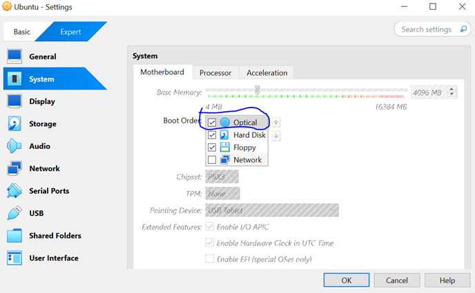
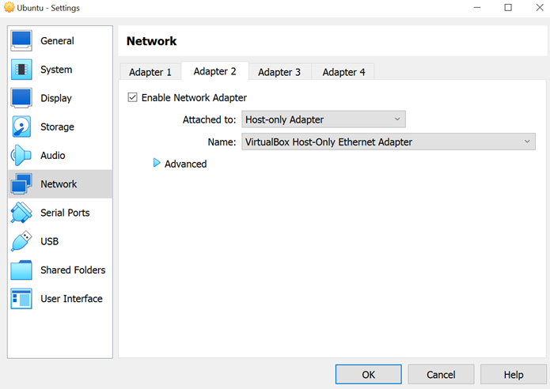
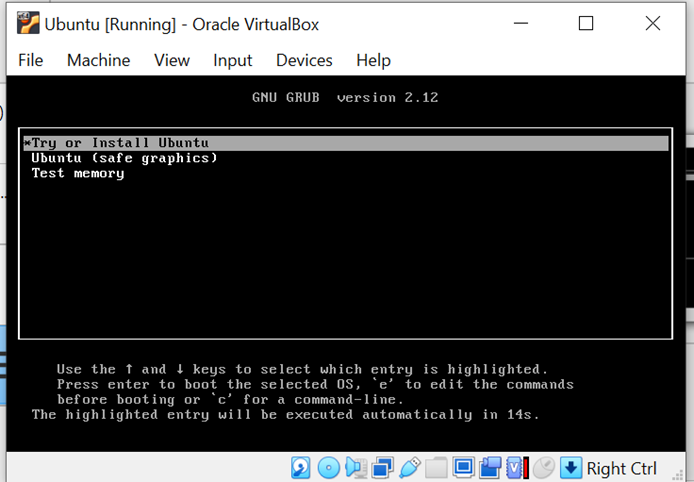
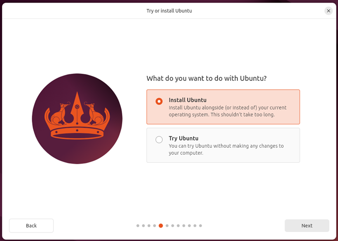

# Ubuntu (Virtual Machine) Installation on VirtualBox
## Objective
This guide provides step-by-step instructions for installing an Ubuntu virtual machine (VM) on VirtualBox. Whether you're setting up a VM for development, testing, or cybersecurity training, this walkthrough will ensure a smooth and successful installation process. By the end of this guide, you'll have a fully functional Ubuntu VM ready for use within VirtualBox. Let's get started!

## 1. Download Ubuntu ISO
Visit the [Ubuntu Downloads page](https://ubuntu.com/download/desktop) and download the latest Ubuntu Desktop ISO or Ubuntu Server ISO if you prefer a minimal setup.

## 2. Create a New Virtual Machine (VM)
- Open VirtualBox and click **New**.

- **Enter the following details:**
  * **Name:** Ubuntu (or any name you prefer)
  * **Type:** Linux
  * **Version:** Ubuntu (64-bit)
  * Click **Next**
 
  
## 3. Allocate Resources
- **Memory:** Allocate at least **4 GB (4096 MB)** for a smoother experience.
- **Processor:** Set **2** or more CPUs for better performance (depending on your system). 
 

## 4. Create a Virtual Hard Disk
- Select **Create a virtual hard disk now**.
- Set the disk size to at least **40 GB**, then click **Next**. 

- **Summary:**
  * Verify your configurations are correct.
  * Click **Finish**.
 

## 5. Attach Ubuntu ISO
- Select your newly created **VM** and click **Settings**.
- Navigate to **Storage**, then click the **Empty** CD icon under **Controller: IDE**.
- Click the **CD icon** next to **Optical Drive**, and select **Choose a disk file**.
- Browse and Select the Ubuntu ISO you downloaded, click **OK**. 

**Note:** Verify the Boot Order is correct, it should prioritize booting from the virtual optical drive first during installation. After Ubuntu is installed, the boot order can be adjusted to boot from the virtual **hard drive**.

## 6. Network Configuration (Before Installation)
- Select your VM, click **Settings** > **Network**.
- **Configure the network adapters:**
  
**Adapter 1:**
  * **Enable Network Adapter:** Checked
  * **Attached to:** NAT (default, for internet access)

**Adapter 2:** (for lab scenarios requiring isolated environments)
  * **Enable Network Adapter:** Checked
  * **Attached to:** Host-Only Adapter
  * Select **vboxnet0** (or create one under VirtualBox preferences)

Click **Ok** to save.

## 7. Start the Installation
- Click **Start** to boot the VM with the attached ISO.

**Note:** If you encounter an error like the one below. Wait a few seconds or 1 minute, Ubuntu is preparing to install.

- Select **Install Ubuntu** when prompted, and click **Next**.

## 8. Complete Installation Steps
- **Keyboard Layout:** Select your preferred keyboard layout.
- **Updates and Other Software:** Choose **Normal Installation** and ensure **Download updates while installing Ubuntu** is checked.
- **Installation Type:** Choose **Erase disk and install Ubuntu** (only within the VM).
- **Create User Account:** Set your username, password, and computer name.
- **Installation:** Click **Install** and wait for the process to be completed. 

